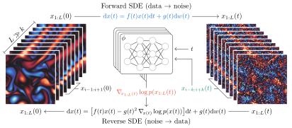

# Score-based Data Assimilation

This repository contains the official implementation of the paper [Score-based Data Assimilation](https://arxiv.org/abs/2306.10574) by [François Rozet](https://github.com/francois-rozet) and [Gilles Louppe](https://github.com/glouppe).

In this work, we build upon diffusion models to enable inference over state trajectories of large scale dynamical systems (atmospheres, oceans, ...) given noisy state observations. Our method, named score-based data assimilation (SDA), learns a score-based generative model of state trajectories based on the key insight that the score of an arbitrarily long trajectory can be decomposed into a series of scores over short segments. After training, inference is carried out in a non-autoregressive manner by generating all states simultaneously.

<p align="center"></p>

Importantly, we decouple the observation model from the training procedure and use it only at inference to guide the generative process, which enables a wide range of zero-shot observation scenarios.

<p align="center"></p>

## Code

The majority of the code is written in [Python](https://www.python.org). Neural networks are built and trained using the [PyTorch](https://pytorch.org/) automatic differentiation framework. We also rely on [JAX](https://github.com/google/jax) and [jax-cfd](https://github.com/google/jax-cfd) to simulate fluid dynamics and on [POT](https://github.com/PythonOT/POT) to compute Wasserstein distances. All dependencies except [jax-cfd](https://github.com/google/jax-cfd) are provided as a [conda](https://conda.io) environment file.

```
conda env create -f environment.yml
conda activate sda
```

We recommend to install [jax-cfd](https://github.com/google/jax-cfd) directly from its repository.

```
pip install git+https://github.com/google/jax-cfd
```

To run the experiments, it is necessary to have access to a [Slurm](https://slurm.schedmd.com/overview.html) cluster, to login to a [Weights & Biases](https://wandb.ai) account and to install the [sda](sda) module as a package.

```
pip install -e .
```

### Organization

The [sda](sda) directory contains the implementations of the [dynamical systems](sda/mcs.py), the [neural networks](sda/nn.py), the [score models](sda/score.py) and various [helpers](sda/utils.py).

The [lorenz](experiments/lorenz) and [kolmogorov](experiments/kolmogorov) directories contain the scripts for the experiments (data generation, training and evaluation) as well as the notebooks that produced the figures of the paper.

> The code for [Score-based Data Assimilation for a Two-Layer Quasi-Geostrophic Model](https://arxiv.org/abs/2310.01853) can be found in the `qg` branch.

## Citation

If you find this code useful for your research, please consider citing

```bib
@inproceedings{rozet2023sda,
  title={Score-based Data Assimilation},
  author={Fran{\c{c}}ois Rozet and Gilles Louppe},
  booktitle={Thirty-seventh Conference on Neural Information Processing Systems},
  year={2023},
  url={https://openreview.net/forum?id=VUvLSnMZdX},
}

@article{rozet2023sda-2lqg,
  title={Score-based Data Assimilation for a Two-Layer Quasi-Geostrophic Model},
  author={Fran{\c{c}}ois Rozet and Gilles Louppe},
  booktitle={Machine Learning and the Physical Sciences Workshop (NeurIPS)},
  year={2023},
  url={https://arxiv.org/abs/2310.01853},
}
```
